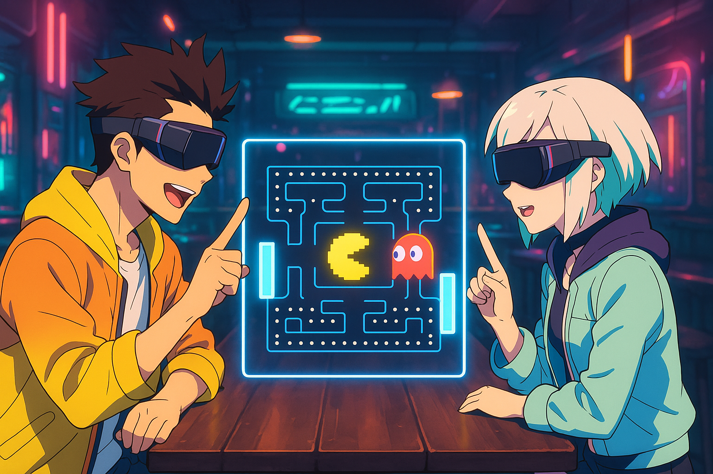

# Night City Pub - WebXR Pong

A cyberpunk-themed WebXR experience featuring classic Pong in virtual reality. Built for Meta DevPost Championship 2025.



## Features

- **VR-Ready Pong Game** - Play with hand controllers or keyboard
- **AI Opponent** - Challenge yourself against a smart AI
- **Cyberpunk Atmosphere** - Neon-lit nightclub environment
- **Cross-Platform** - Desktop preview and VR headset support

## Controls

### Desktop
- **W/S** - Move paddle up/down
- **Space** - Start/Restart game

### VR (Meta Quest)
- **Right Controller** - Move paddle (up/down motion)
- **A/X Button** - Calibrate paddle center
- **B/Y Button** - Start/Restart game

## Tech Stack

- **React Three Fiber** - 3D rendering
- **@react-three/xr** - WebXR integration
- **@react-three/drei** - 3D helpers
- **Three.js** - 3D engine
- **TypeScript** - Type safety
- **GSAP** - Animations

## Installation

```bash
npm install
npm run dev
```

Visit `https://localhost:8081` in your browser or VR headset.

## How to Play

1. Click **"Enter VR"** or start in desktop mode
2. Press **START** button or **Space/B/Y** to begin
3. First to **5 points** wins
4. Move your paddle to defend and bounce the ball back

## Project Structure

```
src/
├── index.tsx          # Main app & scene setup
├── PongGame.tsx       # Game logic & components
├── assets/
│   ├── cyberpunk_nightclub.glb
│   └── xr-cyber-pup.png
└── index.html
```

## Links

- **GitHub**: [Rewonka/night-city-pub](https://github.com/Rewonka/night-city-pub)
- **Based on**: [Meta WebXR First Steps React](https://github.com/meta-quest/webxr-first-steps-react)

## License

MIT License - Built for Meta DevPost Championship 2025

[](https://railway.app/new/template?template=https://github.com/Rewonka/night-city-pub)